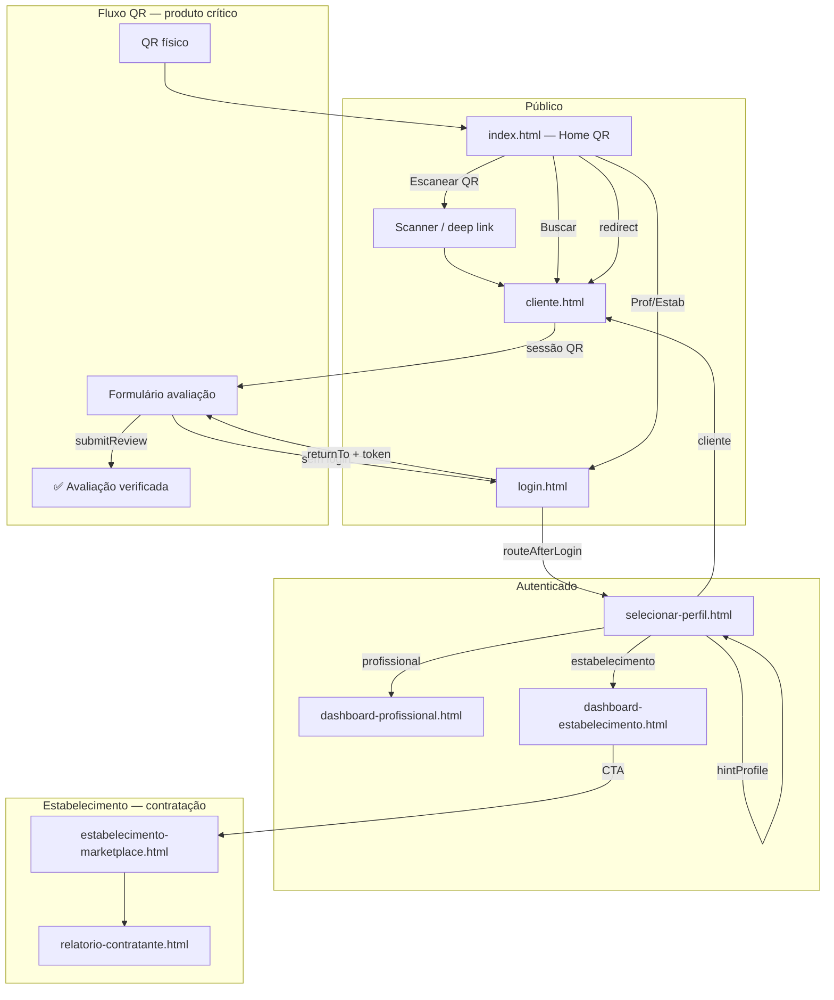

# Relatório Final — Refatoração de Fluxo · Ranking Pro

**Data:** 24/06/2026  
**Autor:** Product Engineer (sessão de arquitetura)  
**Escopo:** Etapa 11 — auditoria geral, fluxos por persona, melhorias implementadas e visão de produto

**Relatórios relacionados:**
- `relatorio-auditoria-ranking-pro.md` — bugs e rotas estabelecimento/marketplace
- `relatorio-ux-ranking-pro.md` — home QR e fluxo de avaliação verificada

---

## Auditoria Geral

### O que é o Ranking Pro hoje

Um **MVP estático** (HTML + JS vanilla) que conecta três personas em torno de **reputação verificada**:

| Camada | Estado | Observação |
|--------|--------|------------|
| **Entrada pública** | ✅ Maduro | Home QR minimalista (`index.html`) |
| **Discovery cliente** | ✅ Funcional | `cliente.html` — busca, match, drawer, favoritos |
| **Avaliação verificada** | ✅ Funcional | QR → sessão → `qr_token` → selo |
| **Profissional** | 🟡 Denso | Dashboard mistura edição + métricas + QR |
| **Estabelecimento** | ✅ Melhorou | Dashboard → marketplace (decisão de contratação) |
| **Multi-perfil** | ✅ Sólido | Seletor explícito pós-login |
| **Infra** | 🟡 Demo | Supabase REST, credenciais em `config.js`, login fake |

### Stack arquitetural

```
HTML estático
    ↓
loader.js (CORE + OPTIONAL por página)
    ↓
flow-registry.js  ← NOVO: mapa canônico de personas
profile-selector.js + router.js + session.js
    ↓
Serviços de domínio (reviews, talent, hiring, user)
    ↓
Boot de página (components/*-boot.js) ou JS inline
    ↓
Supabase REST (api.js)
```

### Inventário de páginas

| Categoria | Quantidade | Exemplos |
|-----------|------------|----------|
| **Produção** | 16 | index, login, cliente, dashboards, marketplace, perfil-page |
| **Onboarding** | 3 | cadastro-cliente, onboarding-prof/prof |
| **DEV/Admin** | 6+ | dev-simulation, apendice, admin, sql-log |
| **Legado/redirect** | 8+ | contratar, profissional, estabelecimento, cliente-bak |

### Pontos fortes do produto

1. **QR como wedge** — diferencial real vs. Google Reviews genérico
2. **Match + IGV** — decisão de contratação com dados, não só estrelas
3. **Multi-perfil** — um usuário pode ser cliente, profissional e dono de estabelecimento
4. **Dock iOS** — navegação contextual compacta em mobile
5. **Perfil unificado** — `perfil-page.html` para profissional e estabelecimento

### Débitos técnicos prioritários

| # | Débito | Severidade |
|---|--------|------------|
| D1 | `cliente.js` ~1900 linhas (monolito) | Alta |
| D2 | `utils.js` ~1770 linhas (score + match + UI) | Alta |
| D3 | Bootstrap inconsistente (loader vs scripts manuais) | Média |
| D4 | Dashboards com JS inline massivo | Média |
| D5 | Naming legado Proofly/contratar em código | Baixa |
| D6 | DEBUG/DEV sempre ativo em `config.js` | Alta (prod) |

---

## Fluxo das Personas

### Mapa consolidado



### 👤 Cliente

| Etapa | Rota | Comportamento |
|-------|------|---------------|
| Entrada QR | `index.html?professionalId&token` | Redirect → `cliente.html` |
| Entrada busca | `cliente.html` | Discovery, tabs prof/est, filtros estilo |
| Pós-login | `selecionar-perfil.html` → `cliente.html` | Home com `clientId` |
| Avaliar | Drawer → `abrirAvaliacaoDrawer` | Login se necessário; QR auto-abre form |
| Satélites | `favoritos.html`, `minhas-avaliacoes.html`, `perfil-page.html` | Reviews, favoritos localStorage |

**Home canônica:** `cliente.html`  
**Registro:** `PERSONA_FLOWS.client` em `flow-registry.js`

### 💼 Profissional

| Etapa | Rota | Comportamento |
|-------|------|---------------|
| Entrada legada | `profissional.html` | **Redirect** → `login.html?intent=professional` |
| Onboarding | `onboarding-profissional.html` | Cadastro multi-step |
| Home | `dashboard-profissional.html` | Edição, métricas, QR, oportunidades |
| QR gerado | `index.html?professionalId&token` | Entrada unificada (antes: cliente.html direto) |
| Guard | `enforceProfileGuard('professional')` | Exige `activeProfile=professional` |

**Home canônica:** `dashboard-profissional.html`  
**Registro:** `PERSONA_FLOWS.professional`

### 🏢 Estabelecimento

| Etapa | Rota | Comportamento |
|-------|------|---------------|
| Entrada legada | `estabelecimento.html` | **Redirect** → `login.html?intent=establishment` |
| Onboarding | `onboarding-estabelecimento.html` | Cadastro do negócio |
| Home | `dashboard-estabelecimento.html` | Bloco "Seu negócio hoje" + CTA marketplace |
| Contratação | `estabelecimento-marketplace.html` | Match, IGV, shortlist |
| Legado | `contratar.html` | Redirect → marketplace |
| Relatório | `relatorio-contratante.html` | PDF decisão de contratação |

**Home canônica:** `dashboard-estabelecimento.html` (não marketplace direto — decisão de produto)  
**Registro:** `PERSONA_FLOWS.establishment`

### Transversal — Multi-perfil

| Regra | Implementação |
|-------|---------------|
| Papel ativo | Só `session.activeProfile` — role do banco **não** pula seletor |
| Pós-login | Sempre `selecionar-perfil.html` (exceto onboarding) |
| Hint de intent | `?hintProfile=professional` destaca card sugerido |
| Alternar perfil | Dock só se `countLinkedProfileRoles > 1` (desktop) |
| Browse only | Opção genérica → `cliente.html` sem `activeProfile` |

---

## Melhorias Implementadas

### Nesta etapa (arquitetura)

| # | Melhoria | Arquivos | Por que mudou |
|---|----------|----------|---------------|
| A1 | **Registro central de fluxos** | `flow-registry.js`, `loader.js` | Rotas espalhadas em 4+ arquivos; difícil auditar e evoluir |
| A2 | **Router usa flow-registry** | `router.js` | `executeRedirect`/`resolveRedirect` agora têm fonte canônica; usuário logado sem intent vai para seletor, não index |
| A3 | **Guard sem perfil → seletor** | `profile-selector.js` | Antes caía em `cliente.html` — errado para estabelecimento/profissional |
| A4 | **hintProfile funcional** | `selecionar-perfil.html`, `profile-selector.js` | Intent do login (`?intent=professional`) agora sugere visualmente o card certo |
| A5 | **Bootstrap unificado** | `minhas-avaliacoes.html`, `selecionar-perfil.html` | Passam a usar `loader.js` + dock consistente |
| A6 | **Landings legadas → redirect** | `profissional.html`, `estabelecimento.html` | Eliminam páginas paralelas que confundiam entrada |
| A7 | **dev-role-simulation sem duplicar** | `menu.js` | Evita carregar o mesmo script duas vezes |
| A8 | **`redirectAfterLogin` unificado** | `profile-selector.js`, `login.html` | Um único ponto pós-auth; `returnTo` (QR) volta direto sem passar pelo seletor |
| A9 | **Redirects legados restantes** | `cliente-home.html`, `index copy.html` | Fecha mapa `LEGACY_REDIRECTS` em `flow-registry.js` |

### Etapas anteriores (consolidado)

| # | Melhoria | Impacto |
|---|----------|---------|
| U1 | Home QR (`index.html` + `index-qr.js`) | Entrada pública alinhada ao wedge do produto |
| U2 | Estabelecimento: dashboard → marketplace | Contratante vê contexto antes de buscar talento |
| U3 | `contratar.html` → `estabelecimento-marketplace.html` | Naming reflete papel + função |
| U4 | Dock iOS compacto, 60% opaco | Sensação app nativo |
| U5 | QR auto-abre avaliação + token no returnTo | Fluxo verificado confiável |
| U6 | `perfil-page.html` unificado | Um componente, dois tipos |
| U7 | Safe area iOS (`viewport-fit`, `theme-color`) | Sem barras brancas |

### Vantagens das mudanças arquiteturais

| Mudança | Vantagem | Impacto no produto |
|---------|----------|-------------------|
| `flow-registry.js` | Uma fonte de verdade para rotas e intents | Onboarding de dev mais rápido; menos regressão ao adicionar persona |
| Guard → seletor | Usuário não cai na área errada | Estabelecimento não vê discovery de cliente por engano |
| hintProfile | Login com intent vira UX guiada | "Sou profissional" → card destacado, menos fricção |
| Redirects legados | Menos superfície de confusão | Links antigos continuam funcionando, destino correto |
| loader unificado | Dock + services consistentes | `minhas-avaliacoes` ganha navegação como app |

---

## Melhorias Sugeridas

### Curto prazo (próximo sprint)

1. **Migrar dashboards para loader.js** — extrair JS inline para `dashboard-profissional.js` / `dashboard-estabelecimento.js`
2. **Split `cliente.js`** — módulos: `cliente-search.js`, `cliente-drawer.js`, `cliente-qr.js`
3. **Avaliação QR sem conta** — OTP e-mail/SMS antes de exigir Google login
4. **Tela pós-avaliação** — confirmação com selo "Verificada enviada"
5. **Renomear resíduos** — `contratar-*` CSS/keys → `marketplace-*`

### Médio prazo

6. **Dashboard view vs edit** — dashboard só decisão; edição em modal/aba
7. **Deep link universal** — `/avaliar/:profId` em vez de query strings
8. **Config por ambiente** — `DEBUG_MODE=false` em build prod; keys via env
9. **Accordion em perfil longo** — reputação, experiência, galeria
10. **CTA contextual em `perfil-page`** — "Propor contratação" vs "Editar perfil"

### Longo prazo

11. **Framework ou bundler** — Vite + componentes para escalar sem monolitos
12. **Auth real** — Supabase Auth ou OAuth; remover login demo
13. **PWA offline** — scanner QR e cache de perfil básico
14. **API BFF** — esconder Supabase direto do browser em produção

---

## Bugs Encontrados

### Corrigidos

| # | Bug | Correção |
|---|-----|----------|
| B1 | Estabelecimento caía direto no marketplace | `getProfileHomeUrl` → dashboard |
| B2 | `contratar.html` confundia papel | Renomeado + redirect |
| B3 | Guard sem perfil → `cliente.html` | Agora → `selecionar-perfil.html` |
| B4 | `hintProfile` ignorado | Card sugerido no seletor |
| B5 | Token perdido no login pós-QR | `returnTo` preserva `token` |
| B6 | Dock opaco demais / barras brancas iOS | Ajustes CSS + safe area |
| B7 | Menu DEV alterado em vez do flutuante | Revertido + polish no dock |

### Pendentes / monitorar

| # | Bug | Severidade | Nota |
|---|-----|------------|------|
| P1 | Login demo hardcoded | 🔴 Alta | Bloqueante para produção |
| P2 | `config.js` com keys expostas | 🔴 Alta | Aceitável em MVP; rotacionar em prod |
| P3 | `cliente.js` monolito | 🟡 Média | Risco de regressão em toda mudança |
| P4 | `buildTagSearchConditions` ILIKE | 🟡 Média | `encodeURIComponent` provavelmente incorreto |
| P5 | TAG_MAP chaves duplicadas | 🟢 Baixa | Última definição vence silenciosamente |
| P6 | Social signals mock | 🟢 Baixa | localStorage + hash, não dado real |
| P7 | Login obrigatório pós-QR | 🟡 Média | Barreira para cliente casual |

---

## Decisões de Arquitetura

### D1 — `flow-registry.js` como fonte canônica

**Decisão:** Criar registro central em vez de espalhar rotas só em `profile-selector.js` e `menu.js`.

**Por que mudou:** A especificação original tratava rotas como implícitas. Com 3 personas, QR, marketplace e multi-perfil, a ausência de mapa explícito gerava bugs (guard errado, hints mortos, router incompleto).

**Vantagens:**
- Auditoria em um arquivo
- `router.js` deixa de ser código morto
- Base para documentação automática e testes futuros

**Impacto:** Baixo risco — `profile-selector.js` mantém API pública; registry é camada adicional.

---

### D2 — Home pública = QR, não vitrine

**Decisão:** `index.html` minimalista; discovery em `cliente.html`.

**Por que mudou:** O wedge do Ranking Pro é **avaliação verificada no ponto de atendimento**, não landing de SaaS genérico.

**Vantagens:** Menos scroll, CTA único, alinhamento com QR gerado pelo profissional.

**Impacto:** Visitante que quer "conhecer o produto" usa link secundário "Buscar profissionais". Trade-off aceito.

---

### D3 — Estabelecimento: dashboard antes do marketplace

**Decisão:** `getProfileHomeUrl('establishment')` → `dashboard-estabelecimento.html`.

**Por que mudou:** Contratante precisa de **contexto do negócio** (métricas, equipe, CTA) antes de buscar talento. Marketplace direto tratava RH como busca genérica.

**Impacto:** +1 clique para contratar, mas decisão mais informada — alinhado a IGV e match.

---

### D4 — `activeProfile` explícito (nunca inferido do banco)

**Decisão:** `getActiveProfileType` lê só `session.activeProfile`.

**Por que:** Usuário multi-role deve **escolher** onde entrar; inferir do `role` no banco quebrava fluxos e gerava telas erradas.

**Impacto:** Sempre passa pelo seletor pós-login — fricção intencional para clareza.

---

### D5 — Redirects em vez de deletar legado

**Decisão:** `profissional.html`, `estabelecimento.html`, `contratar.html` viram redirects.

**Por que:** Links em apêndice, bookmarks e QR antigos não quebram.

**Impacto:** Zero breaking change; superfície de manutenção mínima.

---

### D6 — loader.js como bootstrap padrão (em progresso)

**Decisão:** Páginas prod devem usar `loader.js`; scripts manuais são exceção.

**Por que:** Conjuntos divergentes de scripts causavam páginas sem dock, sem `reviews-service`, sem guards.

**Impacto:** Migração gradual — dashboards ainda pendentes.

---

### D7 — `redirectAfterLogin` com prioridade de `returnTo`

**Decisão:** Após login, se existir `returnTo` na URL, redirecionar **direto** — sem forçar `selecionar-perfil.html`.

**Por que mudou:** No fluxo QR, o cliente já sabe o que quer (avaliar). Obligá-lo a escolher perfil após Google login é atrito desnecessário e risco de abandono.

**Vantagens:**
- QR → login → perfil do profissional em 2 passos, não 3
- `login.html` deixa de duplicar blocos de onboarding

**Impacto no produto:** Conversão pós-QR melhora; login genérico sem `returnTo` continua indo ao seletor com `hintProfile`.

---

## Melhorias Futuras

### Produto

| Horizonte | Iniciativa | Hipótese |
|-----------|------------|----------|
| Q3 2026 | Avaliação QR sem conta | +40% conversão pós-atendimento |
| Q3 2026 | Widget embed maduro | B2B: estabelecimento exibe prova social no site |
| Q4 2026 | Marketplace com disponibilidade real-time | Contratante fecha vaga no mesmo dia |
| 2027 | Reputação portável entre estabelecimentos | Profissional leva histórico verificado |

### Técnico

| Horizonte | Iniciativa |
|-----------|------------|
| Próximo | Extrair módulos de `cliente.js` e `utils.js` |
| Próximo | Vite + tree-shaking para reduzir payload |
| Médio | Supabase Auth + RLS revisado |
| Médio | Testes E2E dos 3 fluxos críticos (QR, marketplace, multi-perfil) |

---

## Observações Pessoais como Product Engineer

### Como enxergo o Ranking Pro

O Ranking Pro não é um "Google Maps de profissionais". É um **sistema de prova** — quem foi atendido deixa rastro verificável, quem contrata vê retorno (IGV), quem busca vê afinidade (match).

O produto tem **dois loops** distintos:

1. **Loop de reputação (B2C → profissional)**  
   QR → avaliação verificada → score sobe → mais contratações  
   *Este é o wedge. Sem ele, vira directory genérico.*

2. **Loop de contratação (B2B → profissional)**  
   Estabelecimento → marketplace → shortlist → relatório → contrata  
   *Este é o monetizador futuro.*

A refatoração de fluxo consolidou o **Loop 1** (home QR, token, auto-formulário) e organizou o **Loop 2** (dashboard → marketplace). Isso era pré-requisito antes de qualquer growth.

### O que me preocupa

**Fricção pós-QR com login Google.** Um cliente que acabou de sair do salão não quer criar conta. Se não resolvermos OTP leve ou avaliação anônima com verificação por dispositivo, o QR bonito na parede não converte.

**Monolitos JS.** `cliente.js` e `utils.js` são bombas-relógio. Cada feature nova aumenta risco de regressão no fluxo QR — que é o mais importante.

**Identidade Proofly vs Ranking Pro.** Código, storage keys e classes CSS ainda dizem Proofly. Isso confunde time e dificulta onboarding de dev. Renomear com migração de localStorage é trabalho chato mas necessário.

### O que me anima

**Multi-perfil bem modelado.** Poucos MVPs tratam "sou dono do bar E profissional de eventos" com seriedade. O seletor explícito + `hintProfile` é a base para crescer sem virar frankenstein.

**Marketplace com match protagonista.** Não é só filtro de estrelas — é "quem combina com o estilo do seu negócio". Isso é defensável.

**Arquitetura estática que funciona.** Sem build step, deploy é arrastar arquivos. Para MVP e demos, isso é velocidade. O custo vem depois — e `flow-registry.js` é o primeiro passo para pagar esse custo com ordem, não com rewrite.

### Recomendação estratégica para próximas decisões

> **Prioridade 1:** Converter QR em avaliação sem login (ou com OTP de 30 segundos).  
> **Prioridade 2:** Separar dashboard de edição — decisão vs formulário.  
> **Prioridade 3:** Bundler + módulos antes de adicionar qualquer feature grande.

O Ranking Pro está no ponto em que **fluxo está claro** e **arquitetura começou a ter mapa**. O próximo salto não é mais tela — é **conversão do QR** e **escala do código**.

---

## Anexo — Arquivos-chave pós-refatoração

| Arquivo | Papel |
|---------|-------|
| `flow-registry.js` | Mapa canônico de personas, homes, intents, legado |
| `profile-selector.js` | Multi-perfil, guards, seletor, hintProfile |
| `router.js` | resolveRedirect com registry |
| `index-qr.js` | Entrada QR: redirect + scanner |
| `loader.js` | Bootstrap CORE + OPTIONAL |
| `menu.js` | Dock contextual por página |
| `reviews-service.js` | Avaliações + sessão QR + qr_token |
| `cliente.js` | Discovery + drawer + avaliação |
| `estabelecimento-marketplace.js` | Contratação + match + IGV |

---

## Histórico de commits (Etapa 11)

| Commit | Descrição |
|--------|-----------|
| `371b96b` | Home QR + relatório UX |
| `3a5de0b` | Screenshots mobile |
| `1cc731a` | flow-registry + relatório final |
| *(pendente)* | redirectAfterLogin + redirects legados |

---

*Etapa 11 concluída. Commits locais — push pendente de auth GitHub.*